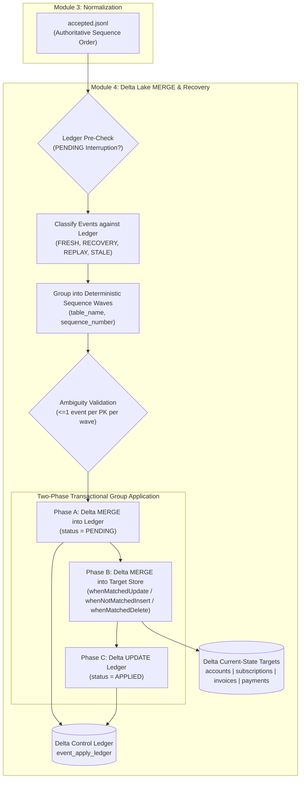
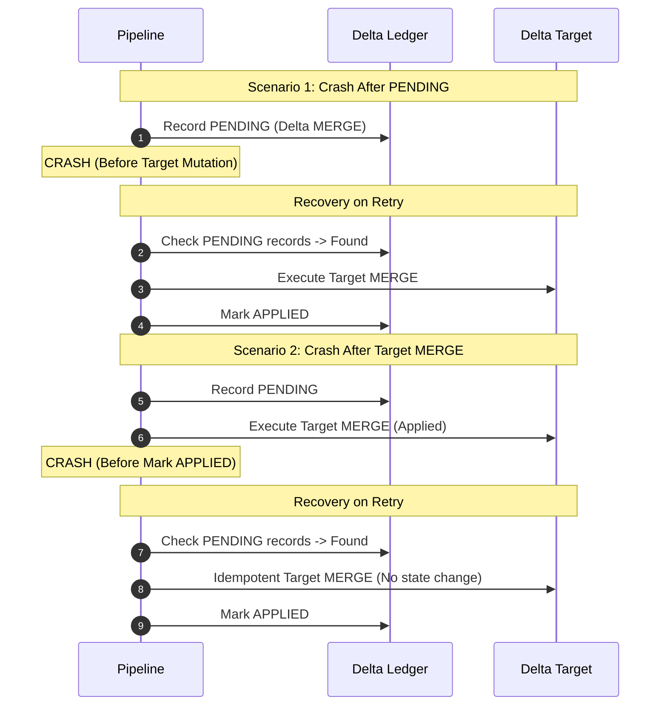

# Module 4: Delta Lake MERGE, Delete Propagation, Idempotent Replay & Recovery

## 1. Architectural Overview

Module 4 implements the **durable current-state Delta Lake storage and mutation layer** for the platform. While Module 3 established which raw CDC events were trustworthy and ordered them authoritatively per entity, Module 4 solves how those canonical accepted CDC events safely mutate durable current-state Delta tables under ACID guarantees, hard/soft delete policies, duplicate deliveries, and crash recovery.



---

## 2. Target Store Layout & Metadata Columns

Current-state tables are stored in Delta format under `data/delta/current/`:

- `data/delta/current/accounts` (Primary Key: `account_id`)
- `data/delta/current/subscriptions` (Primary Key: `subscription_id`)
- `data/delta/current/invoices` (Primary Key: `invoice_id`)
- `data/delta/current/payments` (Primary Key: `payment_id`)

### Metadata Columns
Every target table embeds 8 operational lineage columns alongside its domain fields:

| Column Name | Type | Purpose |
| :--- | :--- | :--- |
| `_last_sequence_number` | `LongType` | Authoritative source sequence number of the last applied mutation. |
| `_last_event_id` | `StringType` | UUID of the CDC event that produced the current state. |
| `_last_operation` | `StringType` | Operation code (`SNAPSHOT`, `INSERT`, `UPDATE`, `DELETE`). |
| `_last_event_fingerprint` | `StringType` | SHA-256 semantic fingerprint of the applied CDC event payload. |
| `_last_source_commit_timestamp` | `StringType` | ISO 8601 UTC timestamp of source database commit. |
| `_last_processing_id` | `StringType` | Deterministic pipeline run identifier for operational provenance. |
| `_is_deleted` | `BooleanType` | Tombstone indicator (`false` for active rows, `true` for soft-deleted rows). |
| `_deleted_at` | `StringType` | ISO 8601 UTC timestamp when soft deletion occurred (null for active rows). |

---

## 3. Two-Phase Applied Event Ledger

The control ledger is stored in Delta format at `data/delta/control/event_apply_ledger`. It serves three functions:

1. **Durable Audit Trail**: Permanent record of every event processed by the platform.
2. **Cross-Processing Sequence Checkpoint**: Authoritative maximum applied sequence per entity key (`entity_sequence_key`), protecting against stale out-of-order replay even if the target row was physically deleted.
3. **Crash Recovery Intent Log**: Tracks two-phase application states (`PENDING` $\rightarrow$ `APPLIED`).

### Ledger Schema
```python
EVENT_LEDGER_SCHEMA = StructType([
    StructField("event_id", StringType(), False),
    StructField("event_fingerprint", StringType(), False),
    StructField("entity_sequence_key", StringType(), False),
    StructField("table_name", StringType(), False),
    StructField("business_key_canonical", StringType(), False),
    StructField("sequence_number", LongType(), False),
    StructField("operation", StringType(), False),
    StructField("source_commit_timestamp", StringType(), False),
    StructField("processing_id", StringType(), False),
    StructField("source_file", StringType(), False),
    StructField("status", StringType(), False),  # PENDING | APPLIED
])
```

---

## 4. Cross-Processing Classification Matrix

When events enter `DeltaMergePipeline`, each event is classified against existing ledger state:

| Ledger Condition | Event Sequence vs Max Applied | Classification | Pipeline Action |
| :--- | :--- | :--- | :--- |
| `event_id` in ledger with `status = APPLIED` and matching fingerprint | N/A | `EXACT_REPLAY_APPLIED` | Skip (No-op; target table untouched; version unchanged). |
| `event_id` in ledger with `status = APPLIED` and conflicting fingerprint | N/A | Conflict | Raise `AppliedEventConflictError`. |
| `event_id` in ledger with `status = PENDING` and matching fingerprint | N/A | `RECOVERY_PENDING` | Resume two-phase application (idempotently apply target & mark `APPLIED`). |
| `event_id` in ledger with `status = PENDING` and conflicting fingerprint | N/A | Conflict | Raise `AppliedEventConflictError`. |
| `event_id` NOT in ledger | `sequence_number < max_applied` | `STALE_SKIPPED` | Skip (Older historical event arriving late; target untouched). |
| `event_id` NOT in ledger | `sequence_number == max_applied` | Conflict | Raise `AppliedSequenceConflictError` (Equal sequence conflict). |
| `event_id` NOT in ledger | `sequence_number > max_applied` | `FRESH` | Stage for two-phase application. |

---

## 5. Sequence Wave Grouping & Ambiguity Protection

Delta Lake MERGE prohibits multiple source records targeting the same primary key in a single MERGE command (which would cause non-deterministic updates).

1. **Deterministic Grouping**: Actionable events (`FRESH` + `RECOVERY_PENDING`) are partitioned into sequence waves keyed by `(table_name, sequence_number)`.
2. **Deterministic Execution Order**: Waves are executed in ascending sort order: `(table_name ASC, sequence_number ASC)`.
3. **Ambiguity Assertion**: Prior to executing any MERGE statement, each wave is validated to ensure that at most **one** event targets any primary key. If duplicate primary keys exist within the same sequence wave, `MergeAmbiguityError` is raised immediately.

---

## 6. Delete Propagation Policies

### HARD Delete Policy (`DeletePolicy.HARD`)
- Uses Delta Lake's native `whenMatchedDelete()` clause.
- Physically removes the record from the current-state target table.
- **Stale Resurrection Protection**: When a row is hard-deleted, `DeltaTargetStore.read_current_table()` no longer contains the record. However, `event_apply_ledger` retains the deleted entity's max sequence number with `status = APPLIED`. Any subsequent arrival of an older sequence INSERT or UPDATE for that entity key is classified as `STALE_SKIPPED`, preventing ghost record resurrection.

### SOFT Delete Policy (`DeletePolicy.SOFT`)
- Uses `whenMatchedUpdate` to update metadata:
  ```python
  set = {
      "_is_deleted": lit(True),
      "_deleted_at": "source._last_source_commit_timestamp",
      "_last_sequence_number": "source._last_sequence_number",
      "_last_event_id": "source._last_event_id",
      "_last_operation": "source._last_operation",
      "_last_event_fingerprint": "source._last_event_fingerprint",
      "_last_source_commit_timestamp": "source._last_source_commit_timestamp",
      "_last_processing_id": "source._last_processing_id",
  }
  ```
- Retains original business data columns untouched.
- `read_current_table(include_deleted=False)` filters out soft-deleted records (`_is_deleted == False`).
- A subsequent `INSERT` or `UPDATE` with a higher sequence number automatically resets `_is_deleted = False` and `_deleted_at = None`.

---

## 7. Crash Recovery Semantics



1. **Crash After Phase A (PENDING written, Target untouched)**:
   On retry, the pipeline detects `RECOVERY_PENDING`, executes the target MERGE, and marks the ledger `APPLIED`.
2. **Crash After Phase B (Target mutated, Ledger still PENDING)**:
   On retry, the pipeline detects `RECOVERY_PENDING`, re-executes the deterministic target MERGE (which is idempotent and produces no duplicate rows or altered data), and completes Phase C by marking the ledger `APPLIED`.
3. **Unresolved Interruption Guard**:
   If an operator attempts to execute an unrelated new batch while unresolved `PENDING` records exist in the ledger from an interrupted run, `PendingRecoveryError` is raised to prevent out-of-order execution across runs.

---

## 8. Verification & Mutation Oracle Reconciliation

Module 4 includes full end-to-end reconciliation against the deterministic Module 1 `SourceMutationEngine`:

- **Bootstrap**: Seed-42 initial snapshot loaded into Delta target tables (accounts: 40, subscriptions: 60, invoices: 120, payments: 90).
- **Mutations Applied**: Batch 1 (8 clean inserts/updates) and Batch 2 (out-of-order, duplicates, hard deletes) normalized through Module 3 and merged via Module 4.
- **Reconciliation Engine**: `reconcile_delta_against_mutation_oracle()` performs field-by-field, row-by-row comparison across all 4 tables:
  - `accounts`: 41 active rows (100% matched)
  - `subscriptions`: 61 active rows (100% matched)
  - `invoices`: 121 active rows (100% matched)
  - `payments`: 90 active rows (90 initial + 1 inserted - 1 deleted = 90; 100% matched)
