# Module 5: Databricks Lakeflow AUTO CDC — Managed CDC, Initial Hydration & SCD Type 2

## 1. Architectural Overview

Module 5 demonstrates how the platform's Change Data Capture (CDC) workload is expressed natively using **Databricks Lakeflow Declarative Pipelines** and **AUTO CDC**. 

While Module 4 built a custom, production-grade local application layer using explicit Delta MERGE statements and a two-phase applied event ledger, Module 5 implements the modern, managed Databricks equivalent: declaring streaming tables and multi-flow CDC ingestion rules that the Databricks Lakeflow engine automatically orchestrates, sequences, and reconciles.

```mermaid
flowchart TD
    subgraph UPSTREAM ["Upstream Data Contracts"]
        SNAP["Module 1 Snapshot Parquet<br/>(Initial Baseline)"]
        CDC["Module 3 Accepted JSONL<br/>(Normalized CDC Stream)"]
    end

    subgraph PROJECTIONS ["Lakeflow Source Projections"]
        SNAP_SRC["Snapshot Hydration Datasets<br/>(sequence_number = 0, operation = 'SNAPSHOT')"]
        CDC_SRC["Continuous CDC Datasets<br/>(Flattened Payload + Primary Key Coalesce)"]
    end

    subgraph LAKEFLOW_FLOWS ["Declarative AUTO CDC Flows"]
        direction TB
        subgraph ACC_FLOWS ["Accounts Flows"]
            F_ACC_HYD["Flow: accounts_initial_hydration<br/>(once = true, SCD Type 1)"]
            F_ACC_CDC["Flow: accounts_continuous_cdc<br/>(continuous, SCD Type 1)"]
        end
        subgraph SUB_FLOWS ["Subscriptions Flows"]
            F_SUB_HYD["Flow: subscriptions_initial_hydration<br/>(once = true, SCD Type 1)"]
            F_SUB_CDC["Flow: subscriptions_continuous_cdc<br/>(continuous, SCD Type 1)"]
            F_SUB_SCD2_HYD["Flow: subscriptions_history_initial_hydration<br/>(once = true, SCD Type 2)"]
            F_SUB_SCD2_CDC["Flow: subscriptions_history_continuous_cdc<br/>(continuous, SCD Type 2)"]
        end
        subgraph INV_FLOWS ["Invoices Flows"]
            F_INV_HYD["Flow: invoices_initial_hydration<br/>(once = true, SCD Type 1)"]
            F_INV_CDC["Flow: invoices_continuous_cdc<br/>(continuous, SCD Type 1)"]
        end
        subgraph PAY_FLOWS ["Payments Flows"]
            F_PAY_HYD["Flow: payments_initial_hydration<br/>(once = true, SCD Type 1)"]
            F_PAY_CDC["Flow: payments_continuous_cdc<br/>(continuous, SCD Type 1)"]
        end
    end

    subgraph TARGETS ["Managed Streaming Tables"]
        T_ACC[("accounts_current<br/>(SCD Type 1)")]
        T_SUB[("subscriptions_current<br/>(SCD Type 1)")]
        T_SUB_HIST[("subscriptions_history<br/>(SCD Type 2 Tracked)")]
        T_INV[("invoices_current<br/>(SCD Type 1)")]
        T_PAY[("payments_current<br/>(SCD Type 1)")]
    end

    SNAP --> SNAP_SRC
    CDC --> CDC_SRC

    SNAP_SRC --> F_ACC_HYD & F_SUB_HYD & F_SUB_SCD2_HYD & F_INV_HYD & F_PAY_HYD
    CDC_SRC --> F_ACC_CDC & F_SUB_CDC & F_SUB_SCD2_CDC & F_INV_CDC & F_PAY_CDC

    F_ACC_HYD & F_ACC_CDC --> T_ACC
    F_SUB_HYD & F_SUB_CDC --> T_SUB
    F_SUB_SCD2_HYD & F_SUB_SCD2_CDC --> T_SUB_HIST
    F_INV_HYD & F_INV_CDC --> T_INV
    F_PAY_HYD & F_PAY_CDC --> T_PAY
```



---

## 2. Modern Lakeflow Declarative API

Module 5 adheres strictly to the current Databricks Lakeflow Declarative Pipeline Python and SQL APIs:

- **Python API**:
  ```python
  from pyspark import pipelines as dp

  dp.create_streaming_table(name="...", comment="...")
  dp.create_auto_cdc_flow(
      name="...",
      target="...",
      source="...",
      keys=["..."],
      sequence_by="sequence_number",
      stored_as_scd_type=1,  # or 2
      ...
  )
  ```
- **SQL Reference API**:
  ```sql
  CREATE OR REFRESH STREAMING TABLE accounts_current;
  CREATE FLOW accounts_initial_hydration AS AUTO CDC ONCE INTO accounts_current ...;
  CREATE FLOW accounts_continuous_cdc AS AUTO CDC INTO accounts_current ...;
  ```

> [!IMPORTANT]
> **API Migration Notice**: The deprecated `import dlt` module and legacy `dlt.apply_changes(...)` / `APPLY CHANGES INTO` syntax are not used in Module 5. All pipeline declarations use the unified Lakeflow Spark Declarative Pipeline constructs (`create_auto_cdc_flow` / `CREATE FLOW ... AS AUTO CDC`).

---

## 3. Upstream Ingestion Contracts & Source Projections

Lakeflow AUTO CDC consumes two distinct upstream data assets established by earlier modules:

1. **Initial Hydration Source**:
   - Consumes the frozen Module 1 synthetic Parquet snapshot (`data/source_snapshot/{table}.parquet`).
   - Projecting a deterministic baseline sequence: `sequence_number = 0` (Long) and `operation = 'SNAPSHOT'`.
   - Never uses arbitrary wall-clock timestamps for baseline ordering.
2. **Continuous CDC Source**:
   - Consumes the frozen Module 3 accepted normalized CDC stream (`data/normalized_cdc/*/accepted.jsonl`).
   - Does **not** consume dead-letter quarantine records or Module 2 watermark landing files.
   - Projects flat schema rows suitable for AUTO CDC:
     - **Primary Key**: Preserved for all operations by coalescing `payload.<pk>`, `before_payload.<pk>`, and `business_key.<pk>`. This ensures DELETE events always supply a non-null primary key.
     - **Business Fields**: Unnested from `payload`.
     - **Control & Lineage**: `operation`, `sequence_number`, `latest_event_id`, `latest_event_fingerprint`, `latest_source_commit_timestamp`.
     - **Non-null Invariant**: Explicitly filters `sequence_number IS NOT NULL AND <pk> IS NOT NULL`.

---

## 4. SCD Type 1 Current-State Streaming Tables

Four current-state target streaming tables are registered:
- `accounts_current` (Key: `account_id`)
- `subscriptions_current` (Key: `subscription_id`)
- `invoices_current` (Key: `invoice_id`)
- `payments_current` (Key: `payment_id`)

### Multi-Flow Target Pairing
Every current-state table is targeted by exactly two distinct declarative AUTO CDC flows:
1. **Initial Hydration Flow (`once = True`)**:
   - Exclusively reads the snapshot source dataset once upon initial deployment.
   - Populates the baseline state at `sequence_number = 0`.
2. **Continuous CDC Flow**:
   - Streams ongoing change records.
   - Evaluates delete conditions via `apply_as_deletes = expr("operation = 'DELETE'")`.
   - Excludes CDC control fields (`operation`, `sequence_number`) from the final business target table schema via `except_column_list = ["operation", "sequence_number"]`.

```python
dp.create_streaming_table(name="accounts_current")

# Flow 1: Hydration
dp.create_auto_cdc_flow(
    name="accounts_initial_hydration",
    once=True,
    target="accounts_current",
    source="accounts_snapshot_source",
    keys=["account_id"],
    sequence_by="sequence_number",
    stored_as_scd_type=1,
    except_column_list=["operation", "sequence_number"],
    ignore_null_updates=False,
)

# Flow 2: Continuous
dp.create_auto_cdc_flow(
    name="accounts_continuous_cdc",
    target="accounts_current",
    source="accounts_cdc_source",
    keys=["account_id"],
    sequence_by="sequence_number",
    apply_as_deletes=F.expr("operation = 'DELETE'"),
    stored_as_scd_type=1,
    except_column_list=["operation", "sequence_number"],
    ignore_null_updates=False,
)
```

---

## 5. SCD Type 2 Historical Audit (`subscriptions_history`)

To preserve historical subscription changes (e.g., plan upgrades, price changes, cancellations), Module 5 defines `subscriptions_history` as an **SCD Type 2** streaming table.

### History Tracking Configuration
- **Target**: `subscriptions_history`
- **SCD Mode**: `stored_as_scd_type = 2`
- **Tracked Business Columns**:
  ```python
  track_history_column_list = [
      "account_id",
      "plan_name",
      "billing_cycle",
      "monthly_amount",
      "status",
      "start_date",
      "end_date",
  ]
  ```
- **Managed System Columns**:
  Databricks Lakeflow automatically generates and manages `__START_AT` and `__END_AT` interval timestamp metadata on the target table. These columns are never manually computed or overwritten by user logic.

---

## 6. Delete Semantics & Managed Tombstones

In a distributed CDC pipeline, a `DELETE` event may arrive ahead of an earlier `UPDATE` or `INSERT` due to network reordering.

- **Managed Tombstone Lifecycle**: When Lakeflow AUTO CDC processes a `DELETE`, it physically (or logically) removes the record from current state while maintaining an internal, time-bounded tombstone.
- **Out-of-Order Resurrection Protection**: If a delayed `INSERT` or `UPDATE` with a lower `sequence_number` arrives later, Lakeflow references the internal tombstone and ignores the stale resurrection attempt.
- **Tombstone GC Tuning**:
  ```text
  pipelines.cdc.tombstoneGCThresholdInSeconds = 604800 (7 days)
  ```
  The tombstone garbage collection threshold must always be configured to exceed the maximum anticipated event delay across the streaming infrastructure.

---

## 7. Comparative Analysis: Custom Module 4 vs. Managed Module 5

| Dimension | Module 4 (Custom Engine) | Module 5 (Databricks Lakeflow AUTO CDC) |
| :--- | :--- | :--- |
| **Execution Paradigm** | Imperative Python / PySpark local MERGE pipeline | Declarative streaming tables and CDC flows (`create_auto_cdc_flow`) |
| **ACID Transaction Model** | Two-phase ledger protocol across separate Delta tables | Engine-managed ACID streaming table state |
| **Sequence Ordering** | Deterministic sequence waves + in-memory grouping | Native sequence resolution via `sequence_by="sequence_number"` |
| **Delete Handling** | Explicit `whenMatchedDelete()` + perpetual ledger sequence history | Native `apply_as_deletes` with internal managed tombstones |
| **SCD Type 2 History** | Manual dual-target MERGE logic | Native declarative `stored_as_scd_type=2` and `track_history_column_list` |
| **Initial Hydration** | Explicit bootstrap step (`initialize_targets`) | Declarative `once=True` hydration flow targeting same streaming table |
| **Infrastructure Dependency** | 100% locally testable on standard PySpark 3.5.x | Requires Databricks Lakeflow runtime for live execution |

---

## 8. Deployment Configuration & Environments

Pipeline paths and catalog parameters are externalized through `LakeflowConfig` in [config.py](file:///Users/vijjureddy/Job%20Switch%20Projects/Incremental%20&%20CDC%20Data%20Pipeline/databricks/lakeflow/config.py):

| Parameter | Default Value | Environment Variable Override | Spark Conf Override |
| :--- | :--- | :--- | :--- |
| `catalog` | `main` | `LAKEFLOW_CATALOG` | `lakeflow.catalog` |
| `schema` | `cdc_portfolio` | `LAKEFLOW_SCHEMA` | `lakeflow.schema` |
| `snapshot_base_path` | `/Volumes/main/cdc_portfolio/cdc_data/source_snapshot` | `LAKEFLOW_SNAPSHOT_PATH` | `lakeflow.snapshot_base_path` |
| `normalized_cdc_base_path` | `/Volumes/main/cdc_portfolio/cdc_data/normalized_cdc` | `LAKEFLOW_NORMALIZED_CDC_PATH` | `lakeflow.normalized_cdc_base_path` |
| `tombstone_gc_threshold_seconds`| `604800` (7 days) | `LAKEFLOW_TOMBSTONE_GC_SECONDS` | `lakeflow.tombstone_gc_seconds` |
| `ignore_null_updates` | `False` | `LAKEFLOW_IGNORE_NULL_UPDATES` | `lakeflow.ignore_null_updates` |

---

## 9. Verification & Execution Status

### Local Contract Verification (Passed)
- **Syntax & AST Compilation**: [pipeline.py](file:///Users/vijjureddy/Job%20Switch%20Projects/Incremental%20&%20CDC%20Data%20Pipeline/databricks/lakeflow/pipeline.py) compiles cleanly with zero syntax errors.
- **Registration Harness**: Verified 5 streaming tables (4 SCD1, 1 SCD2) and 10 AUTO CDC flows (5 hydration `once=True`, 5 continuous).
- **Projections**: Verified non-null sequence assertion and primary key preservation on deletes.
- **API Guard**: Verified zero deprecated `apply_changes` or `APPLY CHANGES INTO` tokens in Module 5 files.
- **Isolation**: Verified standard `src` package imports cleanly on local PySpark 3.5 without Databricks runtime.

### Status Boundary
- **Local Test Suite**: **173 passed unit & integration tests** (156 Modules 1–4 + 17 Module 5).
- **Cloud Validation Status**: `NOT CLOUD EXECUTED / DEPLOYMENT READY` (Live pipeline execution, cluster provisioning, and event logs require an active Databricks workspace).
