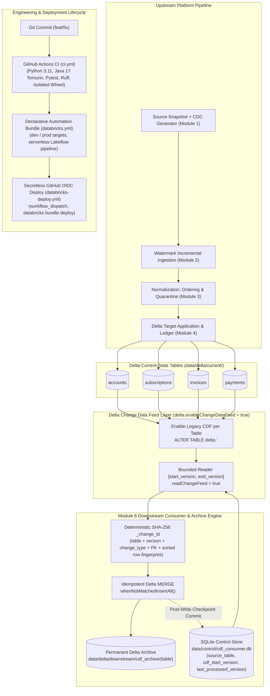

# Module 6: Delta Change Data Feed, Downstream Recovery, CI/CD & Final Production Hardening

## 1. Architectural Overview

Module 6 completes the platform's architectural lifecycle by establishing a reliable, restartable downstream change consumer and permanent audit archive driven by **Delta Change Data Feed (CDF)**, alongside a production **CI/CD** foundation using GitHub Actions and Databricks **Declarative Automation Bundles**.



---

## 2. Three Distinct CDC Concepts

The platform demonstrates three fundamentally distinct change data concepts across Modules 3, 4, 5, and 6:

| Dimension | Tier 1: Source CDC (Module 3) | Tier 2: Target CDC Application (Modules 4 & 5) | Tier 3: Downstream Change Feed (Module 6) |
| :--- | :--- | :--- | :--- |
| **Origin** | Operational upstream database logs (Postgres WAL) | Accepted, ordered normalized change events | Delta Lake table commit log (`_change_data`) |
| **Primary Goal** | Ingest raw at-least-once mutations, validate, order, and quarantine | Mutate current-state Delta tables exactly once with replay recovery | Emit and archive row-level change events produced by target mutations |
| **Mechanisms** | Structural/semantic validators, event fingerprints, sequence sorting | Delta MERGE + event ledger (M4) OR Lakeflow AUTO CDC (M5) | Delta Change Data Feed reader, SQLite consumer state store, permanent archive |
| **Output** | Normalized canonical JSONL stream (`accepted.jsonl`) | Current-state Delta tables (`data/delta/current/*`) | Permanent historical audit tables (`data/delta/downstream/cdf_archive/*`) |

---

## 3. Locally Executable Delta Change Data Feed

### Technology Choice
The local implementation uses **Legacy Delta Change Data Feed** running on standard open-source:
- `pyspark>=3.5.0,<3.6.0`
- `delta-spark>=3.3.0,<3.4.0`

Legacy CDF is enabled explicitly on target tables by Module 6 without modifying frozen Module 4 logic:
```sql
ALTER TABLE delta.`<table_path>`
SET TBLPROPERTIES (
  delta.enableChangeDataFeed = true
)
```

### Canonical Metadata Columns
Delta CDF automatically decorates change records with three system columns:
- `_change_type` (`string`): Identifies the mutation type (`insert`, `update_preimage`, `update_postimage`, `delete`).
- `_commit_version` (`long`): The commit version of the Delta table in which the mutation occurred.
- `_commit_timestamp` (`timestamp`): The physical commit timestamp recorded in the Delta transaction log.

### Mutation Semantics
1. **INSERT Semantics**:
   - Newly inserted records appear in CDF as `_change_type = 'insert'` with full business fields and Module 4 metadata (`_last_sequence_number`, `_last_processing_id`, etc.).
2. **Physical UPDATE Semantics (Preimage & Postimage)**:
   - Physical updates produce **two distinct rows** sharing the same `_commit_version`:
     - `update_preimage`: The row state before the update was applied.
     - `update_postimage`: The row state after the update was applied.
   - Downstream consumers require both images to compute deltas, track attribute transitions, and power event-driven architectures.
3. **HARD DELETE Semantics**:
   - Physical row deletion produces `_change_type = 'delete'`, preserving the complete final deleted pre-delete row image.
4. **SOFT DELETE Semantics**:
   - When a soft delete is executed as an UPDATE setting `_is_deleted = true`, Delta CDF represents this as an `update_preimage` and `update_postimage` pair, **not** as a physical `delete`.

---

## 4. Bounded Reader & Downstream Checkpointing

### Bounded Range Ingestion
The reader consumes bounded, inclusive commit version ranges:
```python
reader = (
    spark.read.format("delta")
    .option("readChangeFeed", "true")
    .option("startingVersion", start_version)
)
if end_version is not None:
    reader = reader.option("endingVersion", end_version)
df = reader.load(source_path)
```

### Consumer State Store (`data/control/cdf_consumer.db`)
Downstream consumer progress is durably maintained in an isolated SQLite table `cdf_consumer_state`:
- `source_table` (`TEXT PRIMARY KEY`)
- `source_path` (`TEXT NOT NULL`)
- `cdf_start_version` (`INTEGER NOT NULL`)
- `last_processed_version` (`INTEGER NOT NULL`)
- `registered_at` (`TEXT NOT NULL`)
- `last_updated_at` (`TEXT NOT NULL`)

### Registration Protocol
- When registering a new table, Module 6 checks if CDF is enabled, enables it if necessary, and captures the enabling Delta commit version as `cdf_start_version`.
- `last_processed_version` is initialized to `cdf_start_version - 1`.
- The first consumption cycle reads from `last_processed_version + 1 == cdf_start_version`.
- Re-registration is idempotent by default (`if_exists="ignore"`).

### Empty-Window & No-Op Semantics
- **No New Data**: If `last_processed_version == current_source_version`, the pipeline immediately exits with `no_op=True` without creating empty archive versions.
- **Empty Version Windows**: If commits in `[start_version, end_version]` contain only metadata or table property updates (yielding 0 CDF data rows), the checkpoint cleanly advances to `end_version` to prevent redundant polling.

---

## 5. Permanent Downstream Archive & Idempotency

### Why CDF $\neq$ Permanent Audit Log
Delta Change Data Feed is transient by design:
- CDF data files and transaction logs are subject to retention windows (`delta.logRetentionDuration`, `vacuum`).
- Running `VACUUM` can remove historical commit files beyond the retention period, rendering historical version ranges unreadable.
- Therefore, downstream consumers must persist change records into a durable, queryable **permanent Delta archive** (`data/delta/downstream/cdf_archive/<table_name>`).

### Deterministic SHA-256 `_change_id`
Each archived change row receives a globally unique, deterministic identifier derived from:
- `source_table`
- `_commit_version`
- `_change_type`
- Business primary key
- Stable row fingerprint (sorted non-metadata business and operational column values)

Because `_change_type` differs between `update_preimage` and `update_postimage`, preimages and postimages receive unique change IDs. Exact replays of the same commit produce identical hashes.

### Archive Idempotency via Delta MERGE
Archive writes execute an idempotent Delta MERGE:
```python
(
    archive_table.alias("target")
    .merge(
        source=prepared_df.alias("source"),
        condition="target._change_id = source._change_id",
    )
    .whenNotMatchedInsertAll()
    .execute()
)
```
- **First Run**: $N$ new CDF rows $\rightarrow$ $N$ archive rows inserted.
- **Replay Run**: Same $N$ rows $\rightarrow$ 0 duplicate rows inserted.

### Crash Failure & Recovery Protocol
1. Bounded CDF read succeeds.
2. Archive MERGE completes successfully.
3. Process crashes before SQLite checkpoint commit (checkpoint remains at previous version).
4. On recovery/retry, the exact same version range is re-consumed.
5. Archive MERGE detects existing `_change_id`s and inserts 0 duplicates.
6. Checkpoint advances to the target version.

---

## 6. Modern Databricks Alternative: Automatic CDF

In contemporary Databricks environments, an alternative to per-table legacy CDF is available:

| Feature | Legacy Delta CDF (Project Proof) | Automatic Change Data Feed (Databricks Modern Alternative) |
| :--- | :--- | :--- |
| **Runtime Requirement** | PySpark 3.5.x / Delta Lake 3.3.x | Databricks Runtime 18 LTS+ |
| **Catalog Requirement** | Local filesystem / Hive / Unity Catalog | Unity Catalog required |
| **Table Configuration** | `delta.enableChangeDataFeed = true` per table | Workspace/catalog/schema level default or automatic |
| **Underlying Mechanism** | Explicit CDF property & `_change_data` files | Engine-level row tracking & commit log capture |
| **Query API** | `readChangeFeed = true` / `table_changes()` | Identical: `readChangeFeed = true` / `table_changes()` |
| **Coexistence** | Standard open-source Delta Lake | Cannot be used simultaneously with legacy CDF on same table |
| **Status in Project** | **LOCALLY EXECUTED & VERIFIED** | **DOCUMENTED / NOT LOCALLY EXECUTED** |

---

## 7. CI/CD & Declarative Automation Bundles

### GitHub Actions CI Quality Gate (`.github/workflows/ci.yml`)
- **Triggers**: `push` and `pull_request` on `main`.
- **Environment**: Ubuntu, Python 3.11, Java 17 Temurin (`actions/setup-java@v4`).
- **Pipeline Stages**:
  1. Dependencies: `pip install -e ".[dev]"`
  2. Full Test Suite: `pytest -v` (all 206 tests across Modules 1–6)
  3. Static Analysis: `ruff check .` (100% clean)
  4. Packaging: `python -m build --wheel`
  5. Isolated Smoke Test: Installs wheel into a clean virtual environment and verifies imports across `src`, `src.source`, `src.cdc`, `src.watermark`, `src.normalization`, `src.merge`, `src.cdf`.
- **Zero Cloud Credentials**: The CI quality gate operates 100% locally and deterministically.

### Databricks Declarative Automation Bundle (`databricks.yml`)
Declarative Automation Bundles (formerly Databricks Asset Bundles) manage deployment of the frozen Module 5 Lakeflow AUTO CDC pipeline:
- **Root Configuration**: [databricks.yml](../databricks.yml) defines bundle name, include paths, variables (`catalog`, `schema`), wheel artifacts, and environments (`dev` and `prod`).
- **Resource Definition**: [resources/lakeflow.pipeline.yml](../resources/lakeflow.pipeline.yml) defines the serverless Lakeflow Declarative Pipeline with modern `schema:` syntax and synchronized `src/**` project source files.
- **Python Import Isolation**: Synchronizes `src/**` and configures `root_path: .` so `src.source.schemas` resolves naturally without pip-installing local PySpark/Delta packages into the Databricks serverless runtime.

### Secretless GitHub OIDC Deployment (`.github/workflows/databricks-deploy.yml`)
- **Trigger**: `workflow_dispatch` manual trigger only (default target: `dev`).
- **Permissions**: `id-token: write`, `contents: read`.
- **Workload Identity Federation**:
  ```yaml
  env:
    DATABRICKS_AUTH_TYPE: github-oidc
    DATABRICKS_HOST: ${{ vars.DATABRICKS_HOST }}
    DATABRICKS_CLIENT_ID: ${{ vars.DATABRICKS_CLIENT_ID }}
  ```
- **CLI Commands**: `databricks bundle validate -t ${{ inputs.target }}` and `databricks bundle deploy -t ${{ inputs.target }}`.
- **Execution Boundary**: Deployment validates and deploys bundle infrastructure. It does **not** trigger or run the production pipeline.

---

## 8. Verification & Execution Status

### Local Verification (Passed)
- **Unit & Integration Tests**: 206 tests passing (Module 1: 38, Module 2: 30, Module 3: 49, Module 4: 39, Module 5: 24, Module 6: 26).
- **Linter & Formatter**: Ruff 100% clean (0 errors, 0 warnings).
- **Wheel Packaging**: Built and verified in isolated virtualenv.
- **Delta CDF End-to-End**: Genuine Delta operations verified (INSERT, UPDATE pre/postimage, HARD DELETE, SOFT DELETE, archive idempotency, and crash recovery).

### Status Summary
- **Module 1**: `FROZEN / COMPLETE`
- **Module 2**: `FROZEN / COMPLETE`
- **Module 3**: `FROZEN / COMPLETE`
- **Module 4**: `FROZEN / COMPLETE`
- **Module 5**: `FROZEN / COMPLETE / CLOUD VALIDATION PENDING`
- **Module 6**: `COMPLETE / CLOUD DEPLOYMENT PENDING`
- **Bundle Deployment Status**: `CONFIGURED / CLOUD DEPLOYMENT NOT EXECUTED`
- **Overall Project Status**: `IMPLEMENTATION COMPLETE`
- **Learning Status**: `NOT STUDIED / PENDING` across all modules.
